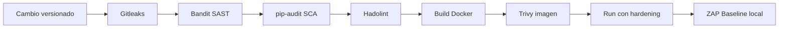

# Docker + DevSecOps: caso práctico UTN FRLP

Caso práctico reproducible para Ingeniería en Sistemas de Información. Compara una aplicación Flask mínima en una **versión insegura con fallas educativas controladas** y una **versión endurecida**, integrando controles desde el código hasta la ejecución del contenedor.

> Todo el análisis dinámico de esta guía apunta a la aplicación local de la demo. La aplicación no depende de servicios externos y no usa secretos reales, base de datos, frontend ni microservicios. Las herramientas se ejecutan en Docker para reducir instalaciones en Windows; GitHub Actions es el único servicio externo usado opcionalmente para la etapa de CI solicitada.

## Objetivo académico

Demostrar de forma práctica cómo DevSecOps incorpora verificaciones de seguridad durante el ciclo de vida de una aplicación contenerizada. El ejercicio permite observar hallazgos, corregirlos y comparar el comportamiento de runtime. Los escáneres ayudan a encontrar riesgos; una salida limpia no prueba que el sistema sea seguro.

## DEV, SEC y OPS

- **DEV:** aplicación y dependencias Python, cambios versionados, build reproducible e imagen identificable.
- **SEC:** SAST con Bandit, secret scanning con Gitleaks, SCA con pip-audit, análisis de Dockerfile con Hadolint, vulnerabilidades de imagen con Trivy y DAST pasivo con OWASP ZAP Baseline.
- **OPS:** ejecución local con Docker, usuario `appuser`, raíz de filesystem read-only, capabilities descartadas y `no-new-privileges`.

## Arquitectura y flujo

La aplicación expone solo `GET /` y `GET /health` en el puerto 5000 del contenedor. La variante insecure se publica en `localhost:5000` y secure en `localhost:5001`. Los escáneres CLI se descargan como imágenes Docker temporales; ZAP Baseline corre en otro contenedor y llega al host local de Windows mediante `host.docker.internal`.



## Estructura

```text
insecure/                 Aplicación y Dockerfile de comparación vulnerable
secure/                   Aplicación y Dockerfile endurecidos
scripts/                  Build, escaneos, ejecución, DAST y limpieza PowerShell
reports/                  Informes locales, ignorados por Git
demo/DEMO.md              Guion cronometrado de exposición
.github/workflows/        CI para la variante segura
.gitleaks.toml            Única regla para el marcador ficticio educativo
RESULTADOS.md             Tabla para completar con salidas reales
```

## Requisitos locales

- Windows 10/11 con PowerShell y Docker Desktop iniciado (contenedores Linux).
- Conectividad para descargar imágenes y bases de datos de escaneo.
- Puertos locales 5000 y 5001 disponibles.
- Git es necesario para versionar y ejecutar el workflow en GitHub; la demo de scripts puede hacerse desde una carpeta.

No hace falta instalar Python, Bandit, Gitleaks, pip-audit, Hadolint, Trivy ni ZAP en Windows.

## Inicio rápido

Desde la raíz del proyecto:

```powershell
.\scripts\build.ps1
.\scripts\run-insecure.ps1
Invoke-RestMethod http://localhost:5000/
Invoke-RestMethod http://localhost:5000/health
docker exec devsecops-insecure whoami
```

Detener la variante vulnerable antes de probar la otra:

```powershell
.\scripts\stop.ps1
.\scripts\run-secure.ps1
Invoke-RestMethod http://localhost:5001/
Invoke-RestMethod http://localhost:5001/health
docker exec devsecops-secure whoami
```

## Comparación de variantes

| Área | `insecure/` | `secure/` |
|---|---|---|
| Código | Marcador secreto ficticio y `debug=True` (Bandit) | Sin marcador, `debug=False` |
| Dependencias | Flask 2.2.2 y Werkzeug 2.2.2 fijados para SCA | Flask 3.1.3 fijado para reproducibilidad |
| Base y copia | `python:3.12`, copia amplia, instalación sin optimizar | `python:3.12-slim`, copia selectiva, `--no-cache-dir` |
| Usuario | No declara `USER`, por defecto root | Usuario sin privilegios `appuser` |
| Runtime | Raíz escribible y defaults de Docker | `--read-only`, `--cap-drop=ALL`, `no-new-privileges`, tmpfs `/tmp` |

La dependencia antigua se eligió con un advisory real: Flask anterior a 2.2.5 (incluida 2.2.2) está afectado por CVE-2023-30861 en ciertas condiciones de caché y sesiones persistentes. Este ejemplo no implementa sesiones ni explota el fallo; sirve para que SCA detecte una versión listada como afectada. [GitHub Advisory Database](https://github.com/advisories/GHSA-m2qf-hxjv-5gpq). Flask 2.2.5 corrigió el problema en esa rama. [Historial oficial de Flask](https://github.com/pallets/flask/blob/main/CHANGES.rst).

El pin seguro actual es Flask 3.1.3. Si el índice de vulnerabilidades se actualiza y esa versión arroja nuevos hallazgos, actualice el pin tras revisar fuentes de advisories y registre la fecha en `RESULTADOS.md`.

## Controles locales

### Build

```powershell
.\scripts\build.ps1
```

Equivale a construir `docker-devsecops:insecure` con `insecure/Dockerfile` y `docker-devsecops:secure` con `secure/Dockerfile`, usando el directorio raíz como contexto.

### Bandit y Gitleaks

```powershell
.\scripts\scan-code.ps1
```

Bandit analiza ambos `app.py`. La versión insecure debe mostrar el hallazgo asociado a Flask debug; secure debe pasar sin ese hallazgo. Gitleaks usa `.gitleaks.toml`, una regla personalizada estrecha que solo detecta `DEMO-ONLY-NOT-A-CREDENTIAL-...`, y analiza las carpetas por separado para que la comparación no se mezcle. Un exit code distinto de cero de Gitleaks en insecure es esperado.

La demo detecta el archivo de trabajo. Para cubrir historial real, una vez que exista un repositorio Git, puede ejecutarse Gitleaks contra el repositorio; el marcador ficticio será visible también en el historial. No se debe reutilizar este patrón para administrar credenciales reales.

### pip-audit (SCA), Hadolint y Trivy

```powershell
.\scripts\scan-images.ps1
```

Aunque el nombre del script agrupa los análisis de dependencias, Dockerfiles e imágenes, cada sección tiene encabezado. pip-audit consulta el advisory database; el resultado depende de la base en el momento de ejecución. Hadolint puede advertir sobre patrones deliberadamente didácticos del Dockerfile insecure. Trivy imprime la tabla por severidades CRITICAL, HIGH, MEDIUM y LOW para las dos imágenes ya construidas; no hay números prellenados.

### Runtime hardening

```powershell
docker exec devsecops-insecure whoami
docker exec devsecops-secure whoami
docker exec devsecops-secure sh -c 'touch /app/rootfs-write-test'
docker exec devsecops-secure sh -c 'touch /tmp/demo-write'
docker inspect devsecops-secure --format '{{.HostConfig.CapDrop}} {{.HostConfig.SecurityOpt}}'
```

Se espera `root` en insecure y `appuser` en secure. La escritura en `/app` debe fallar porque la raíz del contenedor es de solo lectura; `/tmp` funciona por el tmpfs efímero. `--cap-drop=ALL` quita capabilities Linux adicionales al proceso. `--security-opt=no-new-privileges:true` impide que procesos descendientes obtengan privilegios nuevos mediante mecanismos como SUID. Estos controles reducen superficie y no reemplazan parcheado, revisión del código o controles del host.

### OWASP ZAP Baseline (DAST)

Primero iniciar secure; luego:

```powershell
.\scripts\run-secure.ps1
.\scripts\zap-scan.ps1
```

El script confirma que la aplicación local responde y apunta ZAP a `http://host.docker.internal:5001`. ZAP Baseline realiza spider y análisis pasivo, sin escaneo activo. Los reportes se guardan en `reports/zap-report.html` y `reports/zap-report.json`; pueden existir alertas y deben revisarse. El alcance es exclusivamente la app de esta demostración. [Documentación oficial de Baseline Scan](https://www.zaproxy.org/docs/docker/baseline-scan/).

## GitHub Actions y Shift-Left

El workflow `.github/workflows/devsecops.yml` se ejecuta en `push` a `main` y en `pull_request` cuyo destino es `main`. Evalúa únicamente `secure/`; la variante `insecure/` permanece para comparación educativa y sus hallazgos conocidos no hacen fallar el pipeline normal.

Las etapas son: checkout, Gitleaks, Bandit, pip-audit, Hadolint, build de `docker-devsecops:secure`, reporte/gate de Trivy, una etapa de prueba funcional para `GET /` y `GET /health`, y otra etapa de prueba runtime para usuario y filesystem read-only. Las versiones de escáneres y paquetes están fijadas en el workflow para que la ejecución no dependa de `latest`.

### Política de fallo

- **Gitleaks:** falla si encuentra el marcador ficticio en `secure/`.
- **Bandit:** falla ante issues no suprimidos en `secure/app.py`; el `B104` justificado para el bind del contenedor permanece suprimido.
- **pip-audit:** falla si encuentra vulnerabilidades conocidas en `secure/requirements.txt`; no se configuraron excepciones.
- **Hadolint:** usa umbral `warning`; `DL3066` informativo no falla, mientras que warnings y errores sí.
- **Trivy:** primero muestra los hallazgos **CRITICAL y HIGH** sin bloquear solo por su presencia; después bloquea si aparece algún CRITICAL. La ejecución local registrada cuenta 0 CRITICAL y 51 HIGH, por lo que los HIGH quedan visibles sin ser por sí solos un motivo de fallo.
- **Runtime:** cualquier respuesta HTTP inválida, usuario distinto de `appuser`, escritura permitida en `/app` o escritura fallida en `/tmp` hace fallar el job. El contenedor temporal se elimina mediante `trap`, también cuando un paso falla.

Un pipeline en verde significa que el candidato cumple estos umbrales académicos. No significa que la imagen esté libre de vulnerabilidades: los HIGH/MEDIUM/LOW observados se conservan en `RESULTADOS.md` y deben evaluarse. La política de Critical-only se eligió explícitamente para el estado registrado, que mantiene 51 HIGH y 0 CRITICAL.

Shift-Left consiste en ejecutar estas comprobaciones en cada cambio propuesto a `main`, antes de integrar el cambio. GitHub Actions entrega feedback temprano y repetible; no reemplaza la revisión de los hallazgos, las actualizaciones ni otros controles del entorno.
## Resultados

Completar [RESULTADOS.md](RESULTADOS.md) con las salidas reales: fecha, versiones de herramientas, tag y digest. Los resultados de Trivy y pip-audit cambian con el tiempo; esta guía no inventa conteos. Véase también el guion paso a paso en [demo/DEMO.md](demo/DEMO.md).

## Limpieza

```powershell
.\scripts\stop.ps1
```

Los scripts no borran imágenes ni informes; `reports/` está ignorado por Git para poder conservar evidencia local sin subirla accidentalmente.
